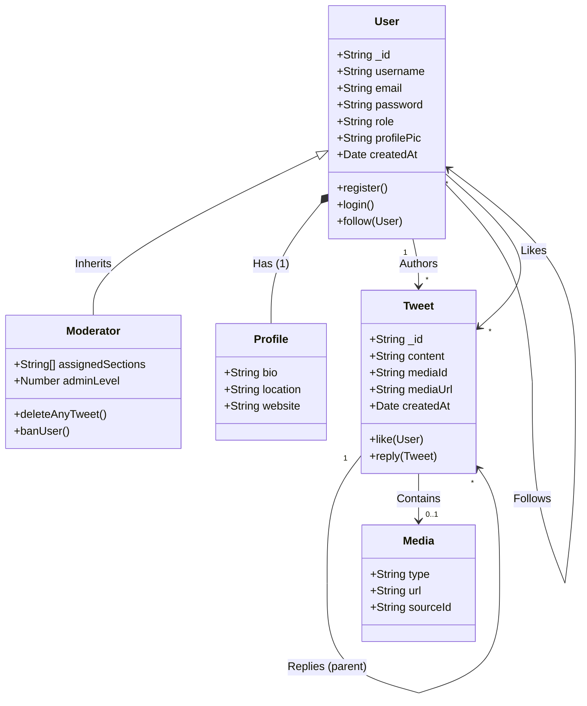

# Design

## UML Class Diagram

## Data Model Description

1.  **User**: The central entity representing a registered account. Contains authentication data (email, password) and social graph connections (followers/following).
2.  **Moderator**: A specialized type of User (implemented via Discriminators) with elevated privileges and additional attributes like `assignedSections`.
3.  **Profile**: An embedded component of the User entity containing display information like bio and location.
4.  **Tweet**: The primary domain object representing a post. Relationships include:
    -   **Author**: The User who created it.
    -   **Parent**: A reference to another Tweet if it is a reply.
    -   **Likes**: A list of Users who liked the content.
5.  **Media**: Represents attached content (images/GIFs) within a Tweet, often linked to external sources (giphy, cloudinary).
